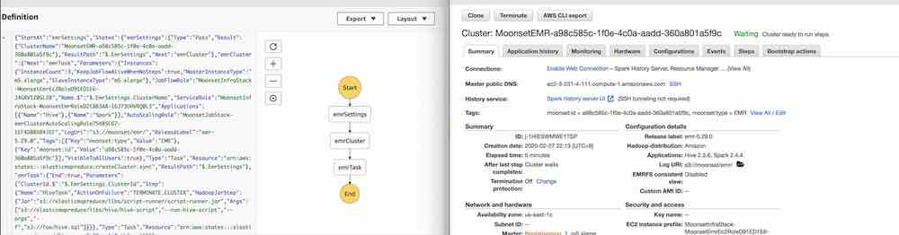

## Moonset EMR Executor 

EMR Executor can run hive & spark tasks in a brand new account without any
setting up, either in schedule mode or adhoc mode. It uses AWS CDK to setup the
infrastructure.  Pick a brand new aws account, and try the following command.

```bash
# config the credentials
npx moonset config

# run a job
npx moonset deploy --job '{
    "input": [
      {"glue": { "dbName": "foo", "tableName": "apple"}}
    ],
    "task": [
      {"hive": {"sqlFile": "s3://foo/hive.sql"}}
    ],
    "output": [
      {"glue": { "dbName": "foo", "tableName": "orange"}}
    ]
}' 

Compose time: 0.03 seconds
Synthesis time: 0.113 seconds
Deploy time: 309.98 seconds
Invoke time: 1.308 seconds
Total time: 311.431 seconds
```


You will see a step function is setup and an EMR is invoked as following.


You can set environment LOG_LEVEL=debug to see more verbose error.
